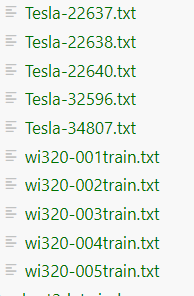
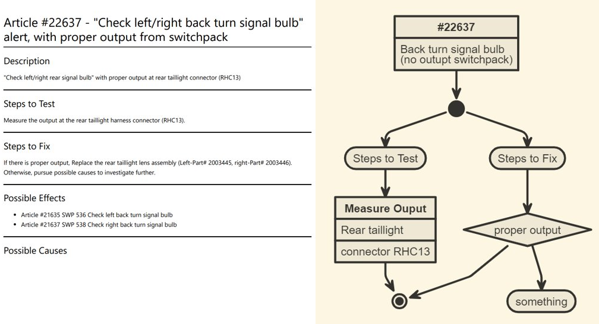
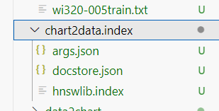
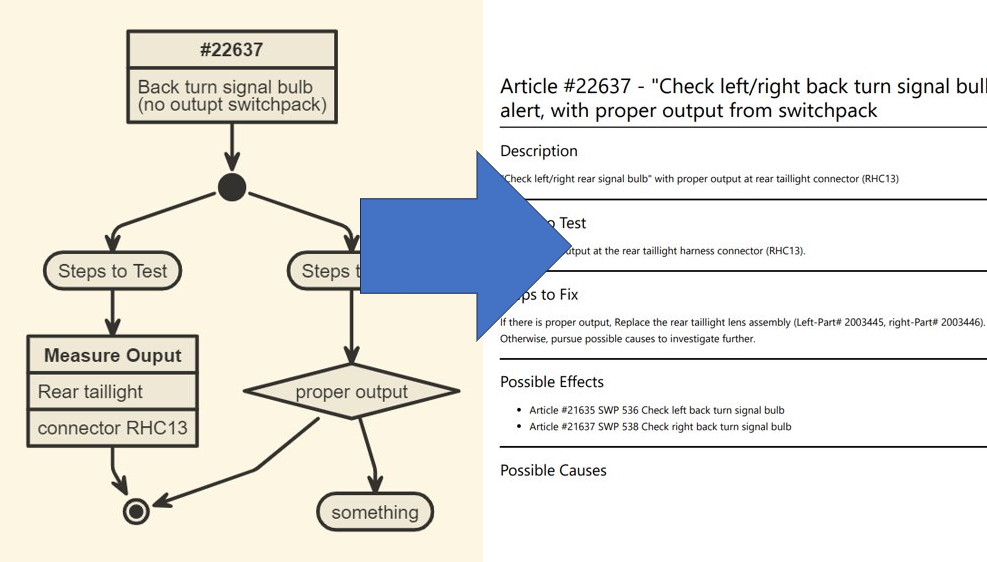
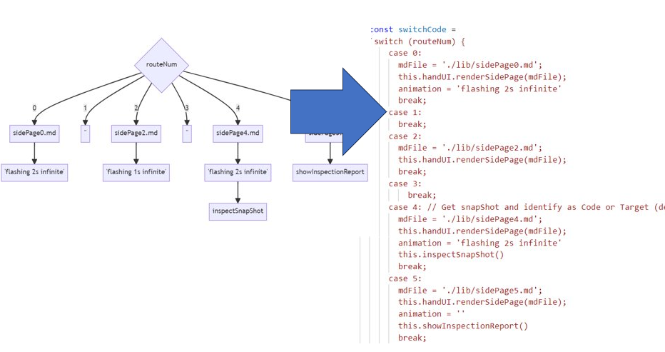
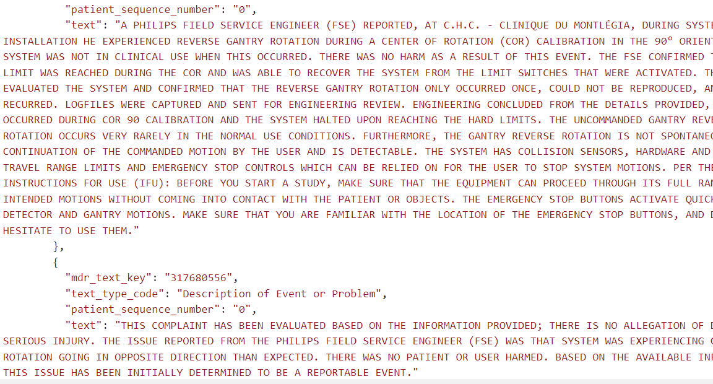

# nomnoml: 
markedown drawing UML (Unified Modeling Language) diagrams
## Snippets
- 1-train.js: generate nomnoml based on **work instruction** text
- 2-train.js: generate text based on nomnoml input
- 3-openFDA.js: data preparation

---
# Proprietary LLM

.. base model + training

- base model: GPT-4 or GPT-3.5 turbo
- training: 
data: secured repository (Azure Cloud) 
alogrithm: 
+vectorstore embedding 
+finetuinging (prompt engineering)
+nascent tools `(eg BLIP2, Salesforce)`
---

# model #1: data2chart
data: mock wi-320
Tesla Maintenance Manual (https://onedrive.live.com/?cid=597A1F50B291367A&id=597A1F50B291367A%216571&parId=597A1F50B291367A%216234&o=OneUp)

---
# training design

- training dataset

---
# vectorstore: data2chart.index

`vlidation_tesla`

---

# model #2-chart2data

---

# model #3-chart 2 codeblock

---

# model #4-flows control

---
# rich model
-- multiple iterations / multiple epochs
- 
- draft rvision history
- tabluated content
- openFDA
---
# openFDA -> auto feed to model
- adverse events

---
# 
- FDA API endpoint
`https://api.fda.gov/device/event.json?search=device.generic_name:tomography&limit=1`

- Intervalize
`// Poll OpenFDA every 60 minutes
setInterval(checkAdverseEvents, 60 * 60 * 1000);`

---
# Github
## https://github.com/metatatt
